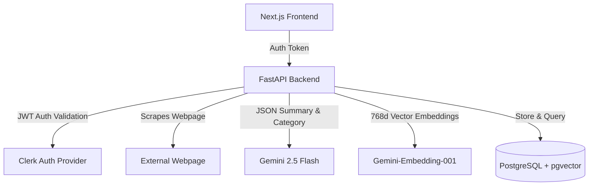

# Project Report: AI Bookmark Vault

An intelligent, AI-powered knowledge repository that converts raw URLs into structured, searchable, and categorized conceptual assets.

---

## 1. Executive Summary & Problem Solved
Traditional bookmarking tools are passive collections of links that quickly degrade into disorganized "link yards." Users face three core problems:
1. **High Friction in Organization**: Categorizing and describing bookmarks manually is tedious, leading users to leave them uncategorized.
2. **Information Retrieval Bottlenecks**: Searching by exact keyword fails when the user only remembers the conceptual theme of an article (e.g., searching for *"container configuration"* when the bookmark title is *"Docker Best Practices"*).
3. **Link Rot**: External websites frequently go offline, change content, or get hidden behind paywalls, destroying the user's saved knowledge.

**AI Bookmark Vault** solves these challenges by automating scraping, using generative AI to summarize and categorize content on the fly, storing high-dimensional vector embeddings of the page content for concept-based semantic search, and laying the groundwork for cached offline archiving.

---

## 2. Technical Stack & Architecture

The application is split into a modern decoupled client-server architecture:



### Frontend
* **Framework**: Next.js (React, TypeScript, App Router)
* **Styling**: Tailwind CSS & Vanilla CSS (with custom animations for transition states)
* **Authentication**: Clerk (JWT-secured API calls)
* **Interactions**: Polling state check (1.5s responsive intervals), optimistic loading cards, swipe-to-refresh gestures.

### Backend
* **Framework**: FastAPI (Python)
* **Database Layer**: SQLAlchemy ORM with PostgreSQL + `pgvector`
* **Concurrency**: FastAPI `BackgroundTasks` for asynchronous scraping, classification, and embedding.
* **Scraper**: Async HTTPX client spoofing standard desktop browser headers with response-size safety boundaries.
* **AI Engine**: Google GenAI SDK (Gemini 2.5 Flash and Gemini-Embedding-001).

---

## 3. Database Schema

The core relational database model leverages PostgreSQL and the `pgvector` extension for storing and performing similarity searches on high-dimensional data:

```sql
CREATE EXTENSION IF NOT EXISTS vector;

CREATE TABLE bookmarks (
    id SERIAL PRIMARY KEY,
    title VARCHAR,
    url VARCHAR NOT NULL,
    summary TEXT,
    category VARCHAR,
    user_id VARCHAR NOT NULL,
    status VARCHAR DEFAULT 'processing',
    embedding vector(768),
    created_at TIMESTAMP DEFAULT CURRENT_TIMESTAMP
);
```

---

## 4. Key Features Implemented

###  Asynchronous Background AI Pipeline
When a URL is posted, the API immediately returns a `status: "processing"` skeleton response to the client in `<50ms`. In the background:
1. The webpage content is scraped asynchronously.
2. If no title was provided, the scraper's extracted title is saved to the database.
3. The page content is sent to **Gemini 2.5 Flash** to generate a 2-sentence summary and categorize the site into pre-defined categories.
4. The title, category, summary, and webpage text snippet are compiled and sent to **Gemini-Embedding-001** to generate a 768-dimensional vector embedding.
5. The database record updates to `status: "completed"`.

###  Concept-Based Hybrid Search
The search endpoint combines vector similarity search with word-order-resilient SQL keyword queries:
1. **Vector Search**: Embeds the user search query into a 768d vector and queries the database using `cosine_distance < 0.65`.
2. **Keyword Search**: Splits the query into multiple terms and performs case-insensitive wildcard searches across `title`, `url`, `summary`, and `category`.
3. **De-duplication & Merging**: Python merges the results, ordering conceptual vector matches at the top, followed by fallback keyword matches.

###  Optimized Edit Routing
When editing a bookmark, if the URL is unchanged, the app bypasses the background AI pipeline and saves metadata updates synchronously. This saves API tokens and provides instant updates for title and category modifications.

---

## 5. Upcoming Feature Roadmap

1. **One-Click Browser Bookmarklet**: A drag-and-drop JavaScript button in the browser bookmark bar that lets users instantly save webpages in the background without opening the vault application.
2. **RAG-Powered Chat Assistant**: An interactive chatbot panel that embeds chat queries, performs vector retrieval across the user's private bookmarks, and uses Gemini to synthesize answers with source citations.
3. **Wayback Archiving (Cached Reading)**: Save the full text scraped on ingestion to a dedicated table, allowing users to view clean, text-only cached copies of saved articles if the original website goes offline.
4. **Browser HTML Import**: A parser supporting standard Netscape HTML imports to enable seamless bulk migration from Chrome, Firefox, and Pocket.
